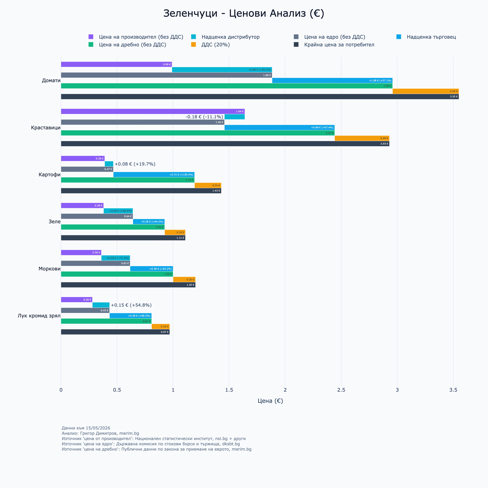
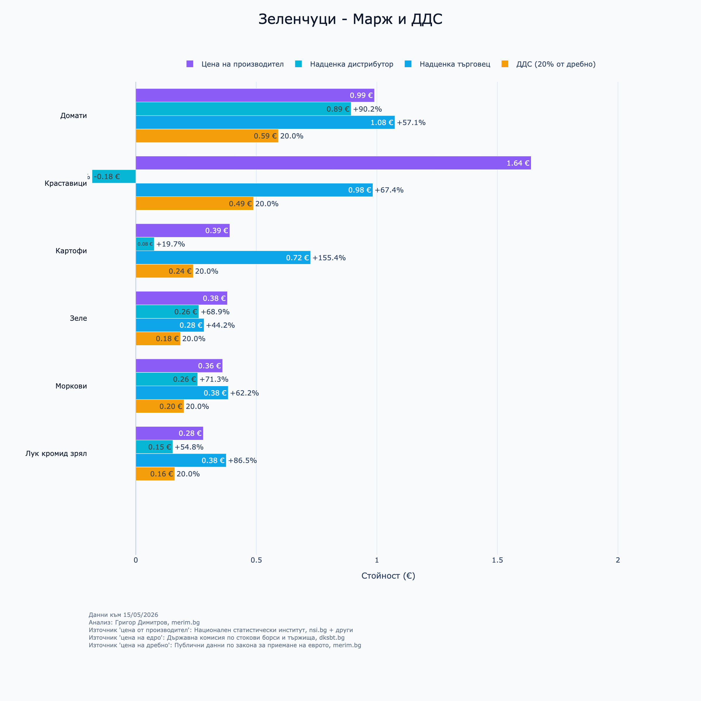
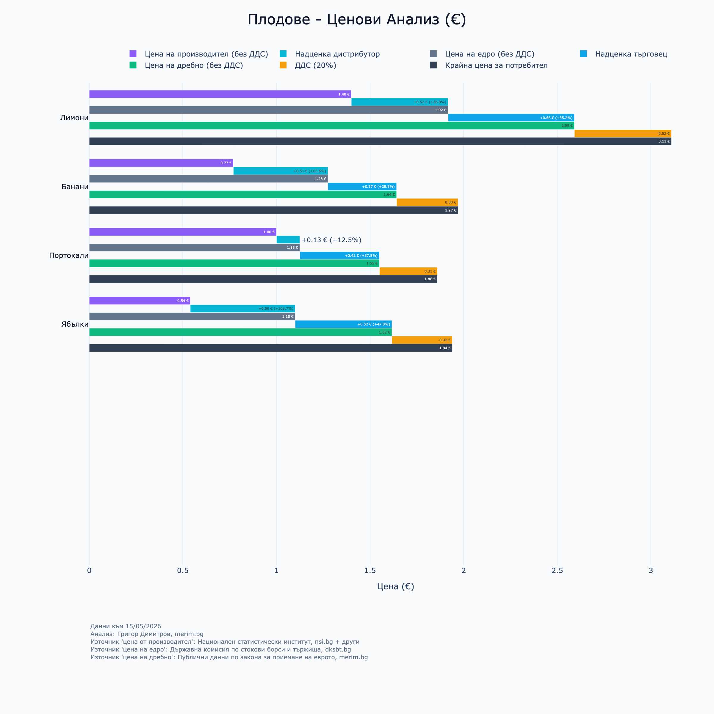
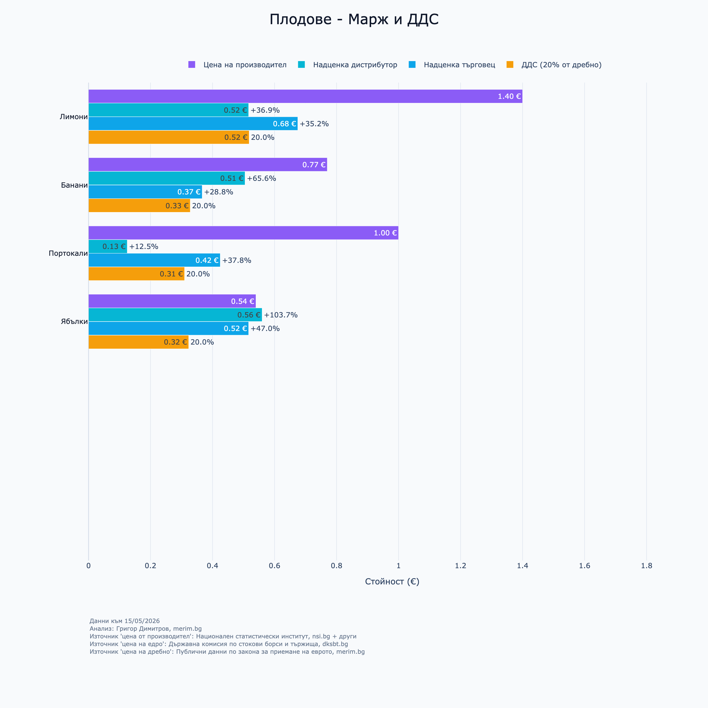
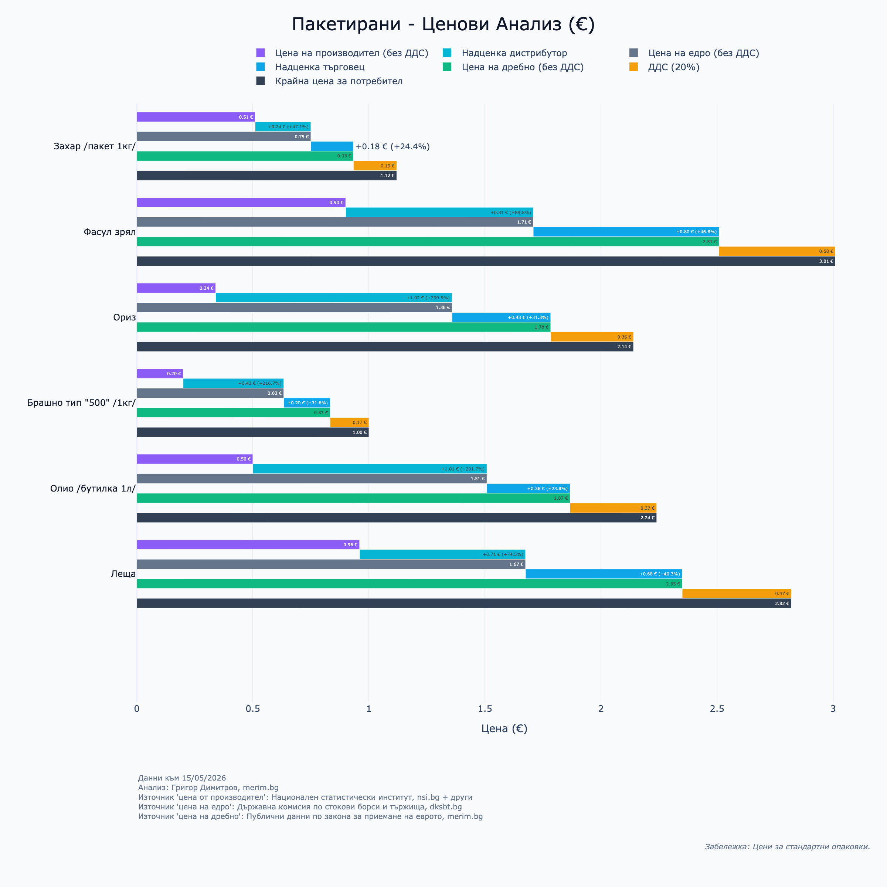
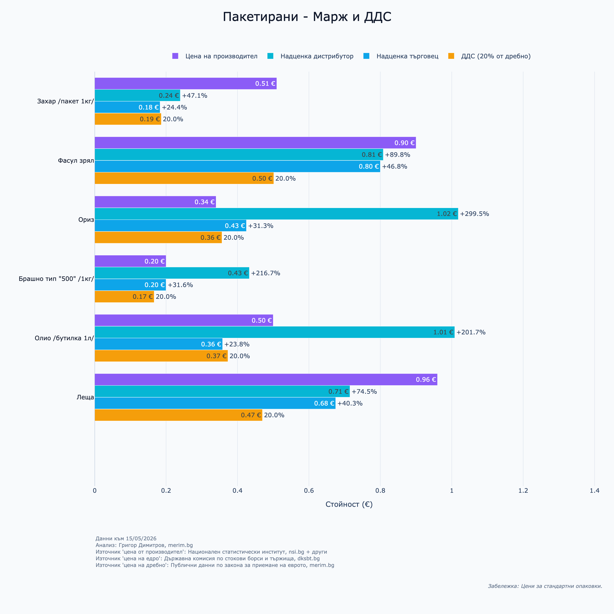
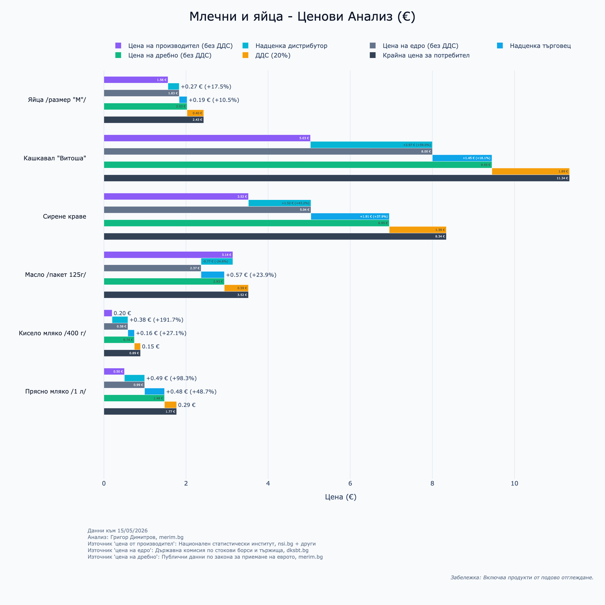
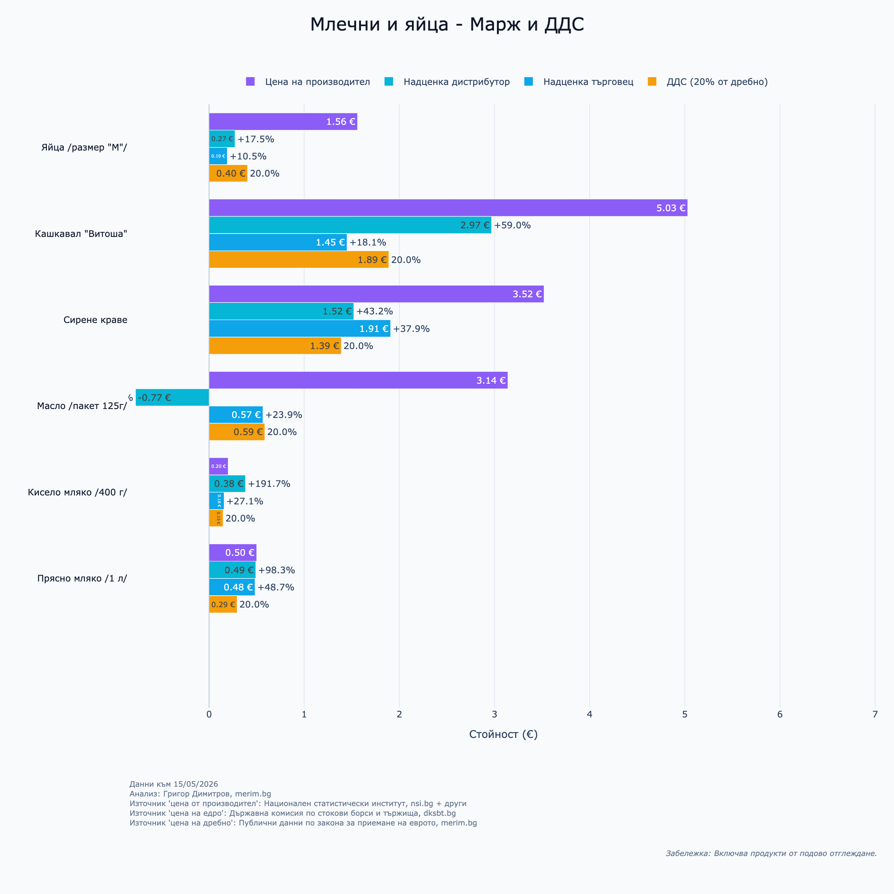
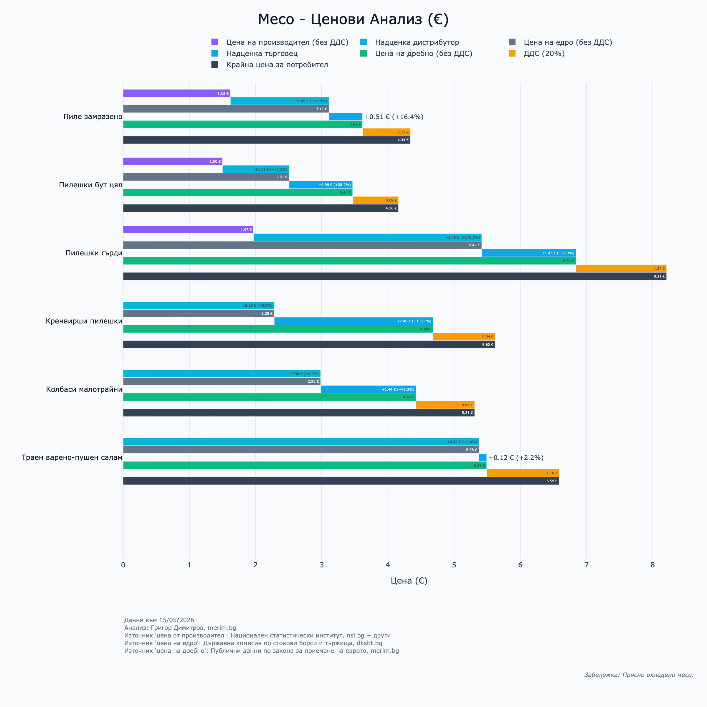
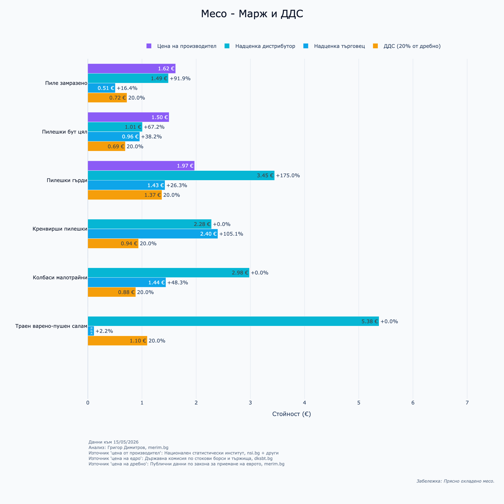

**Резюме на анализа** Настоящата статия предлага базиран на данни преглед на цените и търговските маржове на хранителните продукти в България към май 2026 г. Анализът показва, че текущите законодателни мерки са стабилизирали пазара, а допълнителни рестрикции или създаването на държавни мобилни приложения за цените биха били неефективни, особено в по-малките населени места с ниска конкуренция. За дългосрочно решаване на проблема и реална защита на българските потребители и производители, статията предлага алтернативни мерки, стъпващи върху зелените политики на ЕС: въвеждане на критерий „нулеви мили“ в обществените поръчки; данъчни облекчения за традиционни местни сортове (ЗГУ/ЗНП); общински фискални стимули за насърчаване на късите вериги на доставка; опция за намаляване на ДДС за основни регионални храни.

**За автора:** Григор Димитров — експерт в областта на потребителското поведение с професионален стаж в признати международни компании, включително в един от най-големите търговци на дребно в Европа. Понастоящем предприемач, анализатор и основател на платформата [Merim.bg](https://merim.bg). Бакалавър по аграрен бизнес от УНСС и магистър по поведенческа икономика от Erasmus School of Economics, Rotterdam.

------------------------------------------------------------------------

Правителството обсъжда нови мерки за справяне с растящите цени — сред основните приоритети, начертани по време на предизборната кампания на „Прогресивна България“. През уикенда на 10 май с редица изказвания президентът Йотова постави акцент върху темата в медиите, а парламентът веднага предприе действия за разрешаване на проблема и изпълнение на заявките от предизборната кампания, внасяйки поправки в Закона за въвеждане на еврото и в Закона за защита на потребителите.

Временната комисия по бюджет и финанси към Народното събрание разгледа два законопроекта:

1.  Законопроект за изменение и допълнение на Закона за защита на конкуренцията, № 52-654-01-38/11.05.2026 г., внесен от Явор Гечев и група народни представители.
2.  Законопроект за изменение и допълнение на Закона за защита на потребителите, № 52-654-01-36/11.05.2026 г., внесен от Явор Гечев и група народни представители.

По време на [дебатите](https://parliament.bg/bg/parliamentarycommittees/3783) се изказаха видни политици, експерти от регулаторните органи, както и представители на браншови организации. Въпреки известни разногласия, промените бяха придвижени напред за гласуване. Те целят допълнително да овластят Комисията за защита на конкуренцията (КЗК) и Комисията за защита на потребителите (КЗП), както и да създадат нов специализиран междуинституционален орган, който да противодейства на спекулативните практики и необосновано високите маржове по веригите за доставки на храни.

През последните няколко месеца фокусирах усилията си върху анализа на цените на храните и търговските практики на супермаркетите в България. Резултатът от тази работа е продуктът [**Merim.bg**](https://merim.bg) — независима платформа, финансирана с лични средства и лишена от политически цели, ориентирана изцяло към този проблем.

Наблюденията, които натрупах чрез платформата, неминуемо провокират въпроси относно дискурса в общественото пространство и ефективността на мерките за намаляване на цените, обсъждани във Временната комисия по бюджет и финанси.

В публичното говорене обаче липсват конкретни данни и ясни отговори на няколко ключови въпроса:

- **Цените:** Колко точно са нараснали те?
- **Маржовете:** Колко високи са реалните маржове по веригите за храни?
- **Ефективността:** Какъв е ефектът от текущите мерки?
- **Технологичните решения:** Има ли смисъл от създаването на ново държавно приложение или сайт за цените?
- **Алтернативите:** Какво още може да се направи на законодателно ниво?

Настоящата статия е разделена на две основни части. **В първата част** ще отговоря на въпросите за състоянието на пазара с помощта на публични данни. **Втората част** е посветена на предложения за прецизиране на новите законодателни инициативи, така че да бъдат по-ефективни и съобразени с европейското законодателство.

------------------------------------------------------------------------

## 1. Текущо състояние на пазара

### 1.1. Нива на цените

По-долу е представен анализ на цените, публикувани от търговските вериги съгласно изискванията на Закона за въвеждане на еврото. Данните са индексирани спрямо октомври 2025 г. — първият месец на действие на новото законодателство. Включени са 101 продуктови категории, претеглени спрямо средното потребление за България според данните на НСИ. Анализът обхваща над 200 милиона ценови точки от над 200 вериги и над 3000 магазина в страната.

](plot_by_group.png){.lightbox}

Резултатите показват следното общо повишение: - **+12%** при плодовете и зеленчуците; - **+6%** при хигиената и козметиката.

При всички останали категории се отчита стабилност или незначителни понижения.

Нека разгледаме и конкретните продуктови категории в детайли:

](plot_by_product_categories.png){.lightbox}

При отделни продукти се наблюдават съществени скокове. Например: - **Яйца, хляб и сапун:** увеличение от около **10%**; - **Краставици, свинско месо и шампоани:** увеличение от около **20%**; - **Домати и зеле:** ръст от над **50%**.

*Забележка:* Анализът включва единствено средните равнища на цените в категорията и не отчита намаление на количествата. Това е т.нар. „Шринкфлация“ (Shrinkflation) — феномен, при който цената на продукта остава без промяна, но количеството продукт, което потребителят получава, е намалено.

Въпреки тези внушителни стойности, следва да се отбележи, че те нямат толкова драстично отражение върху общия индекс на потребителската кошница. За текущия месец цената на кошница с 20 основни храни възлиза на **53.73 €**, спрямо **51.35 €** през октомври 2025 г.

](plot_basket.png){.lightbox}

### 1.2. Маржове по веригите

Маржовете между цените на едро и цените на дребно са визуализирани в следващия анализ. Тъй като липсва универсално определение за „справедлив марж“, като база за сравнение в графиките е добавен и компонентът на Данъка върху добавената стойност (ДДС).

**Методология и обработка на данните:**

Анализът стъпва върху три основни показателя:

1.  **Цена на производител:** Агрегирана от НСИ. Данните са в нетен размер (без ДДС) за първото тримесечие на 2026 г. Някои продукти (напр. цитруси) са взети от международни публични бази данни, като източниците са посочени в приложението.
2.  **Цена на едро:** Данни от ДКСБТ към 15.05.2026 г., подадени до Министерския съвет. Тъй като входните данни съдържат ДДС, те са нормализирани до нетен размер (дефлирани с фактор 1.2).
3.  **Цена на дребно:** Публични данни от веригите по Закона за въвеждане на еврото. Крайните цени също са нормализирани до нетен размер (дефлирани с фактор 1.2). Анализът е достъпен в [**Merim.bg**](https://merim.bg/dashboard/).

**Изчисляване на маржовете:**

Всички надценки в графиките са изчислени математически на **нетна база**. - `Надценка дистрибутор` = `(Цена на едро / 1.2) - Цена на производител` - `Надценка търговец` = `(Цена на дребно / 1.2) - (Цена на едро / 1.2)` - `ДДС компонент` = Разликата между брутната и нетната цена на дребно, за да се покаже абсолютната тежест на данъка върху крайния потребител.

При някои продукти, при които производствената цена е за суровина, а потребителският продукт е преработена суровина, са използвани условни стойности, за да се факторира преработката. Например 7 л прясно мляко за 1 кг сирене. Факторите са описани в приложението най-долу.

:::::::: panel-tabset
#### Зеленчуци

::: {layout-ncol="2"}
{.lightbox group="vegetables"}

{.lightbox group="vegetables"}
:::

#### Плодове

::: {layout-ncol="2"}
{.lightbox group="fruits"}

{.lightbox group="fruits"}
:::

#### Пакетирани храни

::: {layout-ncol="2"}
{.lightbox group="packaged"}

{.lightbox group="packaged"}
:::

#### Млечни и яйца

::: {layout-ncol="2"}
{.lightbox group="dairy"}

{.lightbox group="dairy"}
:::

#### Месо и колбаси

::: {layout-ncol="2"}
{.lightbox group="meat"}

{.lightbox group="meat"}
:::
::::::::

## 1.6. Структурен анализ на маржовете по продуктови групи

Прегледът на данните към 15.05.2026 г. отхвърля тезата за линейна „спекула“, показвайки различни пазарни реалности при отделните категории стоки:

- **Зеленчуци и плодове (Логистичен натиск):** При несезонните и вносните стоки основното оскъпяване се генерира по оста производител-едро поради транспортни разходи и риск от развала. При доматите дистрибуторският марж е +104.3% (+1.45 €). Традиционните местни продукти като картофи, лук и ябълки показват балансирана пазарна структура и умерени надценки.
- **Пакетирани храни:** Стоките с дълъг срок на годност минимизират логистичния риск на едро. Търговските вериги обаче компенсират това, като налагат тежки крайни надценки върху базови суровини (ориз с +299.5% и брашно с +216.7% спрямо едро).
- **Млечни продукти и яйца (Двоен натиск):** Млечният сектор страда от натрупване на маржове по цялата верига доставки. Кашкавал „Витоша“ (5.03 € при производител) натрупва +1.45 € на едро и още +2.97 € на дребно. При киселото мляко маржът е концентриран на ниво едро (+191.7%), докато пазарът на яйца показва най-чиста и равнопоставена конкурентна структура.
- **Месо и колбаси:** Прясното птиче месо оперира с минимални надценки на дребно (около 16% при пилешкото). Често супермаркетите го използват като „трафик генератор“ (loss leader) за привличане на клиенти. При трайните колбаси маржът е изцяло изнесен и контролиран на ниво преработка и едро (+5.38 € на едро срещу едва +2.2% на дребно), но категорията е твърде обща за категорични заключения.
- **Фискално изражение на ДДС компонента:** Тъй като ДДС (20%) се начислява най-накрая върху крайната цена, той де факто облага кумулативния сбор от надценките на всички звена по веригата. При стоки като кашкавала фискалната тежест достига 1.89 € на килограм, което надхвърля производствената стойност на редица други продукти и потвърждава ролята на данъчните интервенции като най-бърз лост за облекчаване на потребителя.

### 1.3. Оценка на текущите мерки

От данните става ясно, че настоящият законодателен режим е успял да ограничи повишението и да задържи равнището на цените в съвсем нормални граници. Следователно, допълнително овластяване на регулаторите и драстично увеличаване на глобите не изглеждат икономически обосновани на този етап.

Препоръчително е фокусът да се измести към решаването на техническите проблеми с вече съществуващите мерки, вместо да се въвеждат нови рестрикции, които биха генерирали допълнителна несигурност на пазара.

### 1.4. Предложения за подобряване на текущите мерки

1.  **Изчистване на процеса по публикуване на данните:** В момента КЗП и „Информационно обслужване“ прехвърлят отговорността помежду си относно неработещите системи, грешките в преработката на данни, структурата на данните и т.н. Необходимо е ясно дефиниране на институцията, която носи крайната отговорност.
2.  **Подобряване на качеството на подаваната информация:** Публикуваните данни от веригите съдържат множество грешки. Липсва логика в процес, при който се приемат и реекспортират дефектни масиви от данни (напр. сгрешен формат, грешен адрес, променена номенклатура, липсваща цена или категория). Институциите трябва да публикуват или технически изчистени данни, или суровите масиви директно от веригите, като въведат строга процедура за валидация. Към момента множество магазини не качват данни всеки ден.
3.  **Модернизация на съществуващата инфраструктура:** Ако държавата разполага с бюджет за софтуерни продукти, средствата трябва да бъдат насочени към обновяване на сайта на Държавната комисия по стоковите борси и тържищата (ДКСБТ). Настоящият сайт е на повече от 10 години, често е недостъпен и има сериозни пропуски в сигурността. Същевременно публикуваната информация е с висока аналитична стойност.

### 1.5. Защо държавно приложение е възможно да не проработи

Идеята държавата да разработва собствен потребителски софтуер за сравняване на цените трябва да бъде разглеждана като форма на намеса в частната инициатива, концептуално близка до отхвърлената наскоро идея за държавни „магазини за хората“. Функцията му ще бъде предимно като ПР за подобряване на репутацията на новия кабинет. Дори да приемем, че се намираме в „режим на неотложност“ и подобно приложение е абсолютно необходимо, не бива да се игнорират предишните провалени опити в тази посока.

Преди да се инвестират публични средства, е необходимо да се направи проучване колко от потребителите реално биха имали полза от подобно решение. **Географският анализ** показва, че реална конкуренция (и съответно смисъл от такова приложение) съществува само в големите градове. Но дори там интуицията подсказва, че малко потребители биха се отклонили от магазина, от който пазаруват обичайно, за да отидат до по-далечен обект само заради минимални ценови разлики.

Хората, живеещи в региони с ниско заплащане на труда, често нямат добри алтернативи за пазаруване, което създава условия за **регионално „господстващо положение“** на търговците. Статистиката е категорична:

)*](plot_retail_density.png)

- В **София** има 8.32 магазина на 10 000 души.
- В **Силистра, Пазарджик, Ловеч и Търговище** показателят е около 2.5.
- В **Смолян** — 1.2.
- В **Кърджали** — едва 0.87.

При наличието на 10 пъти по-малка конкуренция на глава от населението в провинцията, едно мобилно приложение за намиране на „най-евтина кошница“ (идея, публично лансирана от заместник министър-председателя Константин Проданов) е по-скоро решение с ограничено приложение там.

**След силната публична заявка приложението явно ще се случи, но пак подчертавам, че не трябва да се игнорират предишните провалени опити. Ако се игнорират, това би довело до провал на единствената реална цел на подобен софтуер, а именно — положителната репутация на новия кабинет.**

------------------------------------------------------------------------

## 2. Предложения относно дългосрочното решаване на проблема с високите цени

Анализирайки публичния дебат, често забелязвам смесване на понятията за „галопиращи“ и „несправедливи“ цени. Дискусиите за мерките обикновено достигат до задънена улица, обвинявайки „господстващото положение“ на пазара. От една страна се приветства свободното ценообразуване, а от друга се изразяват сериозни съмнения доколко пазарът е наистина свободен, като се дават примери как субсидиите причиняват пазарни изкривявания в ущърб на българския потребител.

В този контекст твърде малко се говори за прилагането на съвременни екологични стратегии. Главното ми послание е: **справянето с високите цени на храните може да се случи изключително ефективно чрез инструментите на зелените политики.**

Силно препоръчвам на Министерския съвет да анализира действащото „зелено“ законодателство на ЕС. Именно чрез интегриране на европейските добри практики България може да ограничи ценовите шокове при храните и да създаде силна конкурентна среда за родните производители. По-долу са представени няколко концепции, изцяло съобразени с европейските директиви.

### 2.1. „Нулеви мили“ в зелените обществени поръчки

- **Описание:** Промяна в Закона за обществените поръчки (ЗОП), която задължава държавните и общинските институции (училища, детски градини, болници) да дават голяма тежест (напр. 40%) при оценката на кандидати, предлагащи „къси вериги на доставка“ и нисковъглероден транспорт.
- **Законодателна осъществимост (5/5):** В пълно съответствие със Зелената сделка на ЕС и стратегията „От фермата до трапезата“ (Farm to Fork).
- **Осъществимост на прилагане (3/5):** Изисква сериозно пренаписване на тръжните документации и вероятно ще срещне отпор от големите кетъринг компании.
- **Пример от ЕС:** Във Франция законът „EGalim“ задължава обществените столове да предлагат поне 50% устойчиви или висококачествени продукти, насърчавайки късите вериги на доставка и директното изкупуване от местни земеделци.

### 2.2. Данъчни облекчения чрез географски означения (ЗГУ / ЗНП)

- **Описание:** Стратегия за фискални облекчения за производители и/или търговци, които отглеждат и разпространяват официално сертифицирани традиционни местни сортове (със статут ЗНП/ЗГУ от ЕС или вписани в национални регистри за биоразнообразие).
- **Законодателна осъществимост (4/5):** Защитава европейското земеделско наследство и заобикаля правилата срещу протекционизма.
- **Осъществимост на прилагане (5/5):** Процесът по сертификация на нови сортове на европейско ниво е бавен, но вече имаме редица продукти, които попадат в това определение (например „Българско кисело мляко“ и „Българско бяло саламурено сирене“).
- **Пример от ЕС:** Италия използва стабилна система от регионални и национални финансови стимули за подпомагане на производители на продукти със Защитено наименование за произход (ЗНП) и Защитено географско указание (ЗГУ) като *Пармиджано Реджано* или *Прошуто ди Парма*, осигурявайки им сериозно конкурентно предимство.

### 2.3. Общински фискални стимули „Нулеви мили“

- **Описание:** Овластяване на общинските съвети да предоставят фискални стимули, както и местни данъчни облекчения за ресторанти и малки магазини, които купуват над определен процент от стоката си от локални източници.
- **Законодателна осъществимост (5/5):** Мярката е изцяло в рамките на автономната власт на общините и не изисква одобрение от ЕС или парламента.
- **Осъществимост на прилагане (4/5):** Премахването на таксите е мигновено. Одитирането на фактурите на бизнеса за данъчни облекчения изисква умерен административен капацитет от страна на общината.
- **Пример от ЕС:** В Милано, Италия, чрез местната хранителна политика (Food Policy) се предлагат намаления на данъка върху сметта (TARI) за бизнеси, които даряват излишната храна локално или скъсяват веригите си на доставка.

### 2.4. Задължителни квоти „Нулеви мили“ за търговските вериги (С повишен риск)

- **Описание:** Законово изискване големите супермаркети да отделят сезонен процент (напр. 30%) от рафтовете си за нисковъглеродна регионална продукция, както и въвеждане на забрана за събиране на „такса вход/рафт“ от местни фермери.
- **Законодателна осъществимост (2/5):** Рискована мярка. Съществува голям шанс за стартиране на наказателна процедура от ЕК за нарушаване на единния пазар, освен ако мярката не е перфектно **аргументирана като строго климатична**.
- **Осъществимост на прилагане (2/5):** Силно разрушителна за централизираната логистика на големите вериги, тъй като би изисквала внедряването на сложни мрежи за директни доставки до магазин (Direct-to-Store).
- **Пример от ЕС:** През 2016 г. Румъния прие закон, задължаващ големите супермаркети да зареждат поне 51% от месото, плодовете и зеленчуците си от местни производители. Европейската комисия обаче стартира наказателна процедура, тъй като мярката нарушава принципа на свободно движение на стоки в ЕС. Това подчертава правните рискове при използването на квоти, базирани единствено на национален произход, а не на въглероден отпечатък.

### 2.5. Потенциална извънредна мярка — намалена ставка на ДДС за основни храни (при голям ценови шок)

- **Описание:** Временна извънредна мярка за намаляване на ДДС (напр. на 9%) върху определена кошница от силно нетрайни, регионално произвеждани стоки (яйца, мляко, пресни зеленчуци) по време на инфлационни шокове.
- **Законодателна осъществимост (4/5):** Напълно разрешено от правото на ЕС, стига данъчното намаление да е насочено към *категорията* храни, а не строго да фаворизира местен произход.
- **Осъществимост на прилагане (5/5):** Много бързо за въвеждане чрез НАП и търговския софтуер.

- **Пример от ЕС:** През 2023 г. Испания намали ДДС на 0% за основни хранителни продукти (хляб, мляко, сирене, яйца, плодове и зеленчуци), за да смекчи инфлационния удар върху потребителите. Подобна мярка бе успешно приложена и в Полша.
------------------------------------------------------------------------

## 3. Приложения

### 3.1. Приложение с анализ на маржовете по веригата за храни

```{python}
#| warning: false
import pandas as pd
import io
import numpy as np
import plotly.graph_objects as go
import plotly.io as pio
import textwrap

# Modern Premium Styling
COLOR_PRODUCE = "#8B5CF6" # Violet 500
COLOR_WHOLESALE = "#64748B" # Slate 500
COLOR_MARGIN_POS = "#0EA5E9" # Sky 500
COLOR_MARGIN_NEG = "#F43F5E" # Rose 500
COLOR_RETAIL = "#10B981" # Emerald 500
COLOR_TAX = "#F59E0B" # Amber 500
COLOR_DISTRIBUTOR_MARGIN = "#06B6D4" # Cyan 500
BG_COLOR = "#F8FAFC" # Slate 50
TEXT_MAIN = "#0F172A" # Slate 900
TEXT_MUTED = "#64748B" # Slate 500
FIXED_HEIGHT = 1200
MAX_ITEMS = 7

LEFT_FOOTNOTE = (
    "Данни към 15/05/2026<br>"
    "Анализ: Григор Димитров, merim.bg<br>"
    "Източник 'цена от производител': Национален статистически институт, nsi.bg + други<br>"
    "Източник 'цена на едро': Държавна комисия по стокови борси и тържища, dksbt.bg<br>"
    "Източник 'цена на дребно': Публични данни по закона за приемане на еврото, merim.bg"
)


df = pd.read_csv('rawdata.csv')
df = df.rename(columns={
    'produce_price': 'produce',
    'wholesale_price': 'wholesale',
    'retail_price': 'retail',
    'wholesale_nomenclature': 'dksbt',
    'retail_nomenclature': 'merim'
})

CATEGORY_NOTES = {
    "Плодове и зеленчуци": "Забележка: Сезонни вариации при пресните продукти.",
    "Пакетирани": "Забележка: Цени за стандартни опаковки.",
    "Млечни и яйца": "Забележка: Включва продукти от подово отглеждане.",
    "Месо": "Забележка: Прясно охладено месо."
}

def plot_interactive_price_chart(category_data, category_name):
    cat_df = category_data.copy()
    y_indices = np.arange(len(cat_df))
    labels_short = cat_df['dksbt'].values
    labels_long = cat_df['merim'].values
    
    # Raw values
    vals_produce_net = cat_df['produce'].values # Already without VAT
    vals_wholesale_gross = cat_df['wholesale'].values # Includes VAT
    vals_retail_gross = cat_df['retail'].values # Includes VAT
    
    # Net values
    vals_produce = vals_produce_net
    vals_wholesale = vals_wholesale_gross / 1.2
    vals_retail = vals_retail_gross / 1.2
    
    # Net margins
    diffs = vals_retail - vals_wholesale
    diffs_pct = (diffs / vals_wholesale) * 100
    
    distributor_diffs = vals_wholesale - vals_produce
    distributor_pct = np.divide(distributor_diffs, vals_produce, out=np.zeros_like(distributor_diffs), where=vals_produce!=0) * 100
    
    tax_diffs = vals_retail_gross - vals_retail
    
    # Wrap long labels for better display
    wrapped_labels = ['<br>'.join(textwrap.wrap(label, width=40)) for label in labels_long]

    # Common customdata for consistent tooltips
    customdata_all = list(zip(
        labels_long,
        [f'{p:.2f}' for p in vals_produce],
        [f'{d:+.2f}' for d in distributor_diffs],
        [f'{p:+.1f}' for p in distributor_pct],
        [f'{w:.2f}' for w in vals_wholesale],
        [f'{d:+.2f}' for d in diffs],
        [f'{p:+.1f}' for p in diffs_pct],
        [f'{r:.2f}' for r in vals_retail],
        [f'{t:.2f}' for t in tax_diffs],
        [f'{rg:.2f}' for rg in vals_retail_gross]
    ))

    common_hover = (
        "<b>%{customdata[0]}</b><br>"
        "Производител (без ДДС): %{customdata[1]} €<br>"
        "Надценка дистрибутор: %{customdata[2]} € (%{customdata[3]}%)<br>"
        "Цена на едро (без ДДС): %{customdata[4]} €<br>"
        "Надценка търговец: %{customdata[5]} € (%{customdata[6]}%)<br>"
        "Цена на дребно (без ДДС): %{customdata[7]} €<br>"
        "ДДС (20%): %{customdata[8]} €<br>"
        "Крайна цена: %{customdata[9]} €"
        "<extra></extra>"
    )

    fig = go.Figure()
    
    # 1. Produce (Net)
    fig.add_trace(go.Bar(
        y=y_indices, x=vals_produce, name='Цена на производител (без ДДС)', orientation='h',
        marker_color=COLOR_PRODUCE,
        text=[f'{p:.2f} €' for p in vals_produce], textposition='auto',
        customdata=customdata_all,
        hovertemplate=common_hover
    ))

    # 2. Distributor Margin (Floating)
    fig.add_trace(go.Bar(
        y=y_indices, x=distributor_diffs, base=vals_produce, name='Надценка дистрибутор', orientation='h',
        marker_color=COLOR_DISTRIBUTOR_MARGIN,
        text=[f'{d:+.2f} € ({dp:+.1f}%)' for d, dp in zip(distributor_diffs, distributor_pct)], textposition='auto',
        customdata=customdata_all,
        hovertemplate=common_hover
    ))

    # 3. Wholesale (Net)
    fig.add_trace(go.Bar(
        y=y_indices, x=vals_wholesale, name='Цена на едро (без ДДС)', orientation='h',
        marker_color=COLOR_WHOLESALE,
        text=[f'{w:.2f} €' for w in vals_wholesale], textposition='auto',
        customdata=customdata_all,
        hovertemplate=common_hover
    ))

    # 4. Margin (Retail Margin, Floating)
    margin_base = np.minimum(vals_wholesale, vals_retail)
    margin_color = [COLOR_MARGIN_POS if d >= 0 else COLOR_MARGIN_NEG for d in diffs]
    margin_text = [f'{d:+.2f} € ({dp:+.1f}%)' for d, dp in zip(diffs, diffs_pct)]
    fig.add_trace(go.Bar(
        y=y_indices, x=np.abs(diffs), base=margin_base, name='Надценка търговец', orientation='h',
        marker_color=margin_color,
        text=margin_text, textposition='auto',
        customdata=customdata_all,
        hovertemplate=common_hover
    ))

    # 5. Retail (Net)
    fig.add_trace(go.Bar(
        y=y_indices, x=vals_retail, name='Цена на дребно (без ДДС)', orientation='h',
        marker_color=COLOR_RETAIL,
        text=[f'{r:.2f} €' for r in vals_retail], textposition='auto',
        customdata=customdata_all,
        hovertemplate=common_hover
    ))
    
    # 6. Tax (Floating)
    fig.add_trace(go.Bar(
        y=y_indices, x=tax_diffs, base=vals_retail, name='ДДС (20%)', orientation='h',
        marker_color=COLOR_TAX,
        text=[f'{t:.2f} €' for t in tax_diffs], textposition='auto',
        customdata=customdata_all,
        hovertemplate=common_hover
    ))
    
    # 7. Consumer Price (Gross)
    fig.add_trace(go.Bar(
        y=y_indices, x=vals_retail_gross, name='Крайна цена за потребител', orientation='h',
        marker_color='#334155', # Slate 700 for clear distinction
        text=[f'{rg:.2f} €' for rg in vals_retail_gross], textposition='auto',
        customdata=customdata_all,
        hovertemplate=common_hover
    ))

    fig.update_layout(
        barmode='group',
        title=dict(text=f"{category_name} - Ценови Анализ (€)", font=dict(size=24, color=TEXT_MAIN), x=0.5, y=0.98),
        height=FIXED_HEIGHT,
        template='plotly_white',
        showlegend=True,
        legend=dict(orientation='h', yanchor='bottom', y=1.02, xanchor='center', x=0.5),
        margin=dict(l=150, r=20, t=140, b=250),
        plot_bgcolor=BG_COLOR,
        paper_bgcolor=BG_COLOR,
        xaxis=dict(title='Цена (€)', showgrid=True, gridcolor='#E2E8F0'),
        yaxis=dict(
            title='', showgrid=False, tickfont=dict(color=TEXT_MAIN),
            tickmode='array', tickvals=y_indices, ticktext=labels_short,
            range=[MAX_ITEMS - 0.5, -0.5], autorange=False, fixedrange=True
        )
    )
    
    fig.add_annotation(
        x=0, y=-0.2, xref='paper', yref='paper', 
        text=LEFT_FOOTNOTE, showarrow=False, 
        font=dict(size=10, color=TEXT_MUTED), align='left', xanchor='left', yanchor='bottom'
    )
    
    fig.add_annotation(
        x=1, y=-0.25, xref='paper', yref='paper', 
        text=f"<i>{CATEGORY_NOTES.get(category_name, '')}</i>", showarrow=False, 
        font=dict(size=10, color=TEXT_MUTED), align='right', xanchor='right', yanchor='bottom'
    )

    fig.show()
    return fig

def plot_interactive_normalized_margin_chart(category_data, category_name):
    cat_df = category_data.copy()
    y_indices = np.arange(len(cat_df))
    labels_short = cat_df['dksbt'].values
    labels_long = cat_df['merim'].values
    vals_produce = cat_df['produce'].values
    vals_w = cat_df['wholesale'].values
    vals_r = cat_df['retail'].values
    
    # Calculate Net Margin and Tax amounts
    # Produce price is already net, strip 20% VAT from wholesale and retail
    net_produce = vals_produce
    net_w = vals_w / 1.2
    net_r = vals_r / 1.2
    
    # Net margins
    distributor_vals = net_w - net_produce
    margin_vals = net_r - net_w
    
    # Total VAT in the final price
    tax_vals = vals_r - net_r
    
    # Percentages for labels (Markup % over the net cost)
    distributor_pct = np.divide(distributor_vals, net_produce, out=np.zeros_like(distributor_vals), where=net_produce!=0) * 100
    margin_pct = (margin_vals / net_w) * 100
    
    # Wrap long labels for better display
    wrapped_labels = ['<br>'.join(textwrap.wrap(label, width=40)) for label in labels_long]
    
    # Calculate dynamic x-axis range
    max_val = max(np.max(margin_vals), np.max(tax_vals), np.max(vals_produce), np.max(distributor_vals)) if len(margin_vals) > 0 else 1
    min_val = min(np.min(margin_vals), np.min(distributor_vals), 0) if len(margin_vals) > 0 else 0
    x_max = max_val * 1.4  # Give extra space for labels
    x_min = min_val * 1.1 if min_val < 0 else 0

    # Common customdata for consistent tooltips
    customdata_all = list(zip(
        labels_long,
        [f'{p:.2f}' for p in vals_produce],
        [f'{v:.2f}' for v in distributor_vals],
        [f'{p:+.1f}' for p in distributor_pct],
        [f'{w:.2f}' for w in vals_w],
        [f'{v:.2f}' for v in margin_vals],
        [f'{p:+.1f}' for p in margin_pct],
        [f'{r:.2f}' for r in vals_r],
        [f'{v:.2f}' for v in tax_vals]
    ))

    common_hover = (
        "<b>%{customdata[0]}</b><br>"
        "Производител: %{customdata[1]} €<br>"
        "Надценка дистрибутор (без ДДС): %{customdata[2]} € (%{customdata[3]}%)<br>"
        "Цена на едро: %{customdata[4]} €<br>"
        "Надценка търговец (без ДДС): %{customdata[5]} € (%{customdata[6]}%)<br>"
        "ДДС (в крайната цена): %{customdata[8]} €<br>"
        "Цена на дребно: %{customdata[7]} €"
        "<extra></extra>"
    )

    fig = go.Figure()
    
    # 1. Produce Bar
    fig.add_trace(go.Bar(
        y=y_indices, x=vals_produce, name='Цена на производител', orientation='h',
        marker_color=COLOR_PRODUCE,
        text=[f'{p:.2f} €' for p in vals_produce], textposition='inside',
        customdata=customdata_all,
        hovertemplate=common_hover,
        offsetgroup='produce'
    ))
    
    # 2. Distributor Margin Bar
    fig.add_trace(go.Bar(
        y=y_indices, x=distributor_vals, name='Надценка дистрибутор', orientation='h',
        marker_color=COLOR_DISTRIBUTOR_MARGIN,
        text=[f'{v:.2f} €' for v in distributor_vals], textposition='inside',
        customdata=customdata_all,
        hovertemplate=common_hover,
        offsetgroup='distributor'
    ))
    
    # 3. Distributor Margin Label Bar (Invisible)
    fig.add_trace(go.Bar(
        y=y_indices, x=distributor_vals, name='Дистрибутор %', orientation='h',
        marker_color='rgba(0,0,0,0)',
        text=[f'{p:+.1f}%' for p in distributor_pct], textposition='outside',
        showlegend=False,
        offsetgroup='distributor',
        customdata=customdata_all,
        hovertemplate=common_hover
    ))
    
    # 4. Margin Bar
    margin_color = [COLOR_MARGIN_POS if v >= 0 else COLOR_MARGIN_NEG for v in margin_vals]
    fig.add_trace(go.Bar(
        y=y_indices, x=margin_vals, name='Надценка търговец', orientation='h',
        marker_color=margin_color,
        text=[f'{v:.2f} €' for v in margin_vals], textposition='inside',
        customdata=customdata_all,
        hovertemplate=common_hover,
        offsetgroup='margin'
    ))
    
    # 5. Margin Label Bar (Invisible, for outside percentage label)
    fig.add_trace(go.Bar(
        y=y_indices, x=margin_vals, name='Марж %', orientation='h',
        marker_color='rgba(0,0,0,0)',
        text=[f'{p:+.1f}%' for p in margin_pct], textposition='outside',
        showlegend=False,
        offsetgroup='margin',
        customdata=customdata_all,
        hovertemplate=common_hover
    ))
    
    # 4. Tax Bar
    fig.add_trace(go.Bar(
        y=y_indices, x=tax_vals, name='ДДС (20% от дребно)', orientation='h',
        marker_color=COLOR_TAX,
        text=[f'{v:.2f} €' for v in tax_vals], textposition='inside',
        customdata=customdata_all,
        hovertemplate=common_hover,
        offsetgroup='tax'
    ))
    
    # 5. Tax Label Bar (Invisible, for outside percentage label)
    fig.add_trace(go.Bar(
        y=y_indices, x=tax_vals, name='ДДС %', orientation='h',
        marker_color='rgba(0,0,0,0)',
        text=['20.0%' for _ in tax_vals], textposition='outside',
        showlegend=False,
        offsetgroup='tax',
        customdata=customdata_all,
        hovertemplate=common_hover
    ))
    
    fig.update_layout(
        barmode='group',
        title=dict(text=f"{category_name} - Марж и ДДС", font=dict(size=24, color=TEXT_MAIN), x=0.5, y=0.98),
        height=FIXED_HEIGHT,
        template='plotly_white',
        showlegend=True,
        legend=dict(orientation='h', yanchor='bottom', y=1.02, xanchor='center', x=0.5),
        margin=dict(l=150, r=20, t=140, b=250),
        plot_bgcolor=BG_COLOR,
        paper_bgcolor=BG_COLOR,
        xaxis=dict(title='Стойност (€)', showgrid=True, gridcolor='#E2E8F0', range=[x_min, x_max]),
        yaxis=dict(
            title='', showgrid=False, tickfont=dict(color=TEXT_MAIN),
            tickmode='array', tickvals=y_indices, ticktext=labels_short,
            range=[MAX_ITEMS - 0.5, -0.5], autorange=False, fixedrange=True
        )
    )
    
    # Reference Lines
    fig.add_vline(x=0, line_width=1, line_color=TEXT_MUTED, opacity=0.3)
    
    fig.add_annotation(
        x=0, y=-0.2, xref='paper', yref='paper', 
        text=LEFT_FOOTNOTE, showarrow=False, 
        font=dict(size=10, color=TEXT_MUTED), align='left', xanchor='left', yanchor='bottom'
    )
    
    fig.add_annotation(
        x=1, y=-0.25, xref='paper', yref='paper', 
        text=f"<i>{CATEGORY_NOTES.get(category_name, '')}</i>", showarrow=False, 
        font=dict(size=10, color=TEXT_MUTED), align='right', xanchor='right', yanchor='bottom'
    )

    fig.show()
    return fig

all_figs = []
category_map = {
    "Зеленчуци": "vegetables",
    "Плодове": "fruits",
    "Пакетирани": "packaged",
    "Млечни и яйца": "dairy",
    "Месо": "meat"
}

for category in df['type'].unique():
    category_data = df[df['type'] == category]
    fig = plot_interactive_price_chart(category_data, category)
    all_figs.append(fig)
    
    # Save PNG for gallery lightbox
    safe_name = category_map.get(category, "other")
    img_bytes = pio.to_image(fig, format='png', width=1200, height=1200, scale=2)
    with open(f"plot_price_{safe_name}.png", "wb") as f_out:
        f_out.write(img_bytes)

for category in df['type'].unique():
    category_data = df[df['type'] == category]
    fig = plot_interactive_normalized_margin_chart(category_data, category)
    all_figs.append(fig)
    
    # Save PNG for gallery lightbox
    safe_name = category_map.get(category, "other")
    img_bytes = pio.to_image(fig, format='png', width=1200, height=1200, scale=2)
    with open(f"plot_margin_{safe_name}.png", "wb") as f_out:
        f_out.write(img_bytes)
```

## 3.2. Приложение с анализ на маржините на по веригата за храни (експорт в ПДФ формат)

```{python}
#| warning: false
import io
import plotly.io as pio
from PIL import Image
from IPython.display import display, Markdown

# Създаване на PDF файл с всички генерирани графики
images = []
for f in all_figs:
    img_bytes = pio.to_image(f, format='png', width=1200, height=1200, scale=2)
    img = Image.open(io.BytesIO(img_bytes)).convert('RGB')
    images.append(img)
    
if images:
    images[0].save('all_charts.pdf', save_all=True, append_images=images[1:])

display(Markdown("### [📄 Свалете всички графики като PDF (Високо качество)](all_charts.pdf)"))
```

## 3.3. Приложение с входящите данни, коментари и немонклатури

```{python}
#| echo: false
from IPython.display import display, HTML

# Construct long format table
df_csv = pd.read_csv('rawdata.csv')

part1 = df_csv[['type', 'name', 'produce_nomenclature', 'produce_unit', 'produce_normalization_factor', 'produce_price', 'produce_comments', 'produce_source']].copy()
part1['Тип Цена'] = 'Производител'
part1 = part1.rename(columns={'produce_unit': 'Мярка', 'produce_normalization_factor': 'Фактор', 'produce_price': 'Цена', 'produce_comments': 'Коментар', 'produce_nomenclature': 'Номенклатура', 'produce_source': 'Източник'})

part2 = df_csv[['type', 'name', 'wholesale_nomenclature', 'wholesale_unit', 'wholesale_normalization_factor', 'wholesale_price', 'wholesale_comments', 'wholesale_source']].copy()
part2['Тип Цена'] = 'Едро'
part2 = part2.rename(columns={'wholesale_unit': 'Мярка', 'wholesale_normalization_factor': 'Фактор', 'wholesale_price': 'Цена', 'wholesale_comments': 'Коментар', 'wholesale_nomenclature': 'Номенклатура', 'wholesale_source': 'Източник'})

part3 = df_csv[['type', 'name', 'retail_nomenclature', 'retail_unit', 'retail_price', 'retail_source']].copy()
part3['Тип Цена'] = 'Дребно'
part3['Фактор'] = 1.0
part3['Коментар'] = ''  # No retail comments in CSV
part3 = part3.rename(columns={'retail_unit': 'Мярка', 'retail_price': 'Цена', 'retail_nomenclature': 'Номенклатура', 'retail_source': 'Източник'})

cols = ['type', 'name', 'Номенклатура', 'Тип Цена', 'Мярка', 'Фактор', 'Цена', 'Коментар', 'Източник']

long_df = pd.concat([
    part1[cols],
    part2[cols],
    part3[cols]
]).reset_index(drop=True)

long_df = long_df.rename(columns={
    'type': 'Категория',
    'name': 'Продукт',
    'Номенклатура': 'Номенклатура',
    'Тип Цена': 'Тип Цена',
    'Мярка': 'Мерна Единица',
    'Фактор': 'Фактор',
    'Цена': 'Цена (€)',
    'Коментар': 'Коментар',
    'Източник': 'Източник'
})

# Fill NaNs with empty strings
long_df = long_df.fillna('')
```

::: {.callout-note collapse="true"}
## Детайлна таблица с данни

```{python}
#| echo: false
import pandas as pd
pd.set_option('display.max_rows', None)
long_df
```
:::